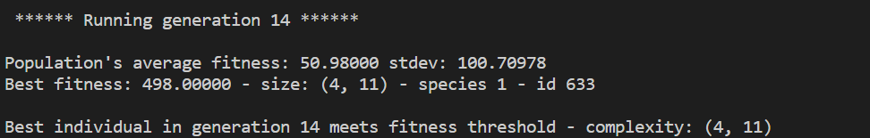
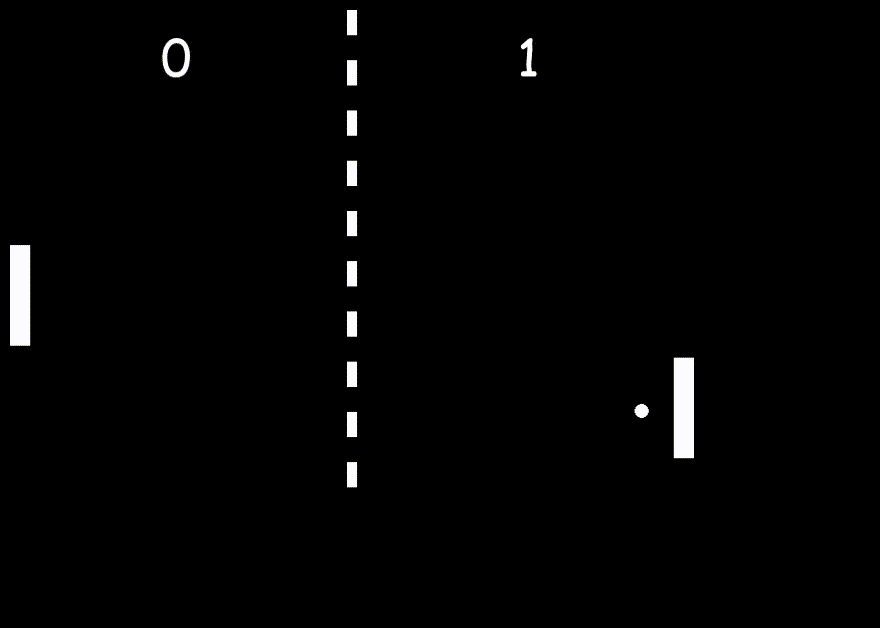

# Pong Game AI

This is a Pong game with an AI player trained using the NEAT (NeuroEvolution of Augmenting Topologies) algorithm. The game is built using the Pygame library and the NEAT algorithm is implemented using the NEAT-Python package.

The objective of the game is to score as many points as possible by hitting the ball past the opponent's paddle. The AI player uses the NEAT algorithm to learn the optimal strategy for playing the game.

## NEAT (NeuroEvolution of Augmenting Topologies)
The NEAT (NeuroEvolution of Augmenting Topologies) algorithm is a method for evolving artificial neural networks. It is a type of genetic algorithm that can be used to optimize the weights and architecture of a neural network.

The NEAT algorithm works by evolving a population of neural networks through a process of selection, mutation, and crossover. Each neural network in the population is represented as a genome, which is a directed graph that specifies the structure of the network. The genome is then translated into a neural network by adding nodes and connections according to a set of rules.

The fitness of each genome is evaluated by testing the corresponding neural network on a given task. The fittest genomes are then selected to be parents of the next generation, which are created by applying mutation and crossover operators to the parent genomes

## Training process
During the training process, the AI player was trained against other AI players generated by the NEAT algorithm. The threshold was set to 400, and it was achieved in the 14th generation. Each AI player was represented by a neural network, which took inputs such as the position of the ball and paddles and generated an output on whether to move up, down or stay still. The training involved generating a population of AI players, evaluating their performance by having them play against each other, and then selecting the fittest players to generate the next generation. This process continued until the threshold was achieved.




## Game Controls
Move left paddle up  :   ```  W key ``` <br>
Move left paddle down: ``` S key ```

## Installation
To run the program, you will need to have Python 3 and the Pygame and NEAT-Python libraries installed.

```
pip install -r requirements.txt
```
## Usage
To train the Model, run the run_neat() function in the __main__ block of the pong_ai.py file i.e line 141 :
```
if __name__ == "__main__":
    run_neat(config) #uncomment this line
```

This will start the training process and save the best-performing model to a file called model.pickle.

To play the game , run the test_ai() function in the __main__ block of the pong_ai.py file i.e line 142 :
```
if __name__ == "__main__":
    test_ai(config) # uncomment this line
```
This will load the best-performing model from the model.pickle file and let you play against it.

During the training and testing process, the game window will open and display the current state of the game, including the score and the position of the paddles and ball.

## DEMO



On Left Human <br>
On Right ML Model

### Resources
- [Original NEAT paper](http://nn.cs.utexas.edu/downloads/papers/stanley.ec02.pdf)
- [NEAT-Python library](https://neat-python.readthedocs.io/en/latest/)
- [Configuration file description
](https://neat-python.readthedocs.io/en/latest/config_file.html)


